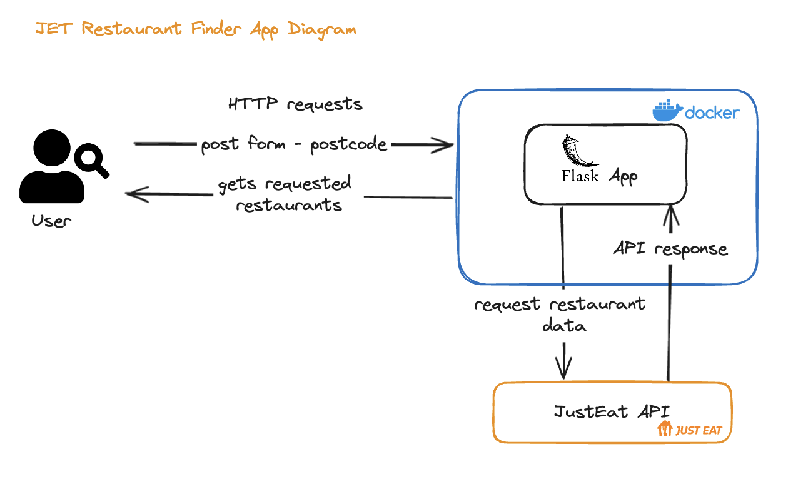

# JET Restaurant Finder

This project is a simple Flask application that uses the Just Eat API to retrieve and filter restaurant data based on a given postcode. The application focuses specifically on restaurant information and displays the following details from the 'restaurant object': Name, Cuisines, Numeric Rating, and Address.

## Getting Started

These instructions will get you a copy of the project up and running on your local machine for development and testing purposes.

## JET Restaurant Finder App Diagram



### Prerequisites

- Python 3.12 or higher
- Flask 3.0.3 or higher
- Requests 2.31.0 or higher
- Poetry 1.8.2 or higher
- Docker
- Docker Compose

### Steps

1. **Clone the repository**

   You can clone the repository by running the following command in your terminal:

   ```bash
   git clone https://github.com/IsiomaIloh/JET_restaurant_finder.git
    ```
   
2. **Navigate to the project directory**

   Change your current directory to the project's directory:

   ```bash
   cd JET_restaurant_finder
   ```
3. **Setup local environment**

      To run the application, there are two options:
      1. **Using Docker (Preferred)**
   
            Install Docker and Docker Compose on your local machine. 
            
            You can find the Docker installation instructions [here](https://docs.docker.com/get-docker/) or using brew:
            
            ```bash
            brew install docker
            ```
         
            You can find the Docker Compose installation instructions [here](https://docs.docker.com/compose/install/) or using brew:
                
            ```bash
            brew install docker-compose
            ```
          
            To install brew on your machine, you can follow the instructions [here](https://brew.sh/).
   
            You can run the application using Docker by running the following command from the Makefile:
      
            ```bash
            make start
            ```
      
            The application will start running at `http://127.0.0.1:8080/`.   
         <br/><br/>
         **Testing the application with Docker**
          
            To run the tests, navigate to the project directory and run the following command:
             
            ```bash
            make test
            ```
             
            This will run all the tests in the project.
      <br/><br/>
      2. **Using Poetry**

         **Install Poetry locally**
         
           You can install Poetry by running the following command in your terminal:
    
           ```bash
           curl -sSL https://install.python-poetry.org | python3 -
           ```
         
         To check Poetry was installed successfully or if it is already installed, run the following command:
         
         ```bash
            poetry --version
         ```
         <br/><br/>
         **Install the dependencies**

         You can install the dependencies by running the following command:

         ```bash
         poetry install
         ```
         
         ```bash
         poetry shell
         ```
         <br/><br/>
         ***Run the application***

         To run the application, navigate to the project directory and run the following command:

         ```bash
         flask run --host=0.0.0.0 --port=8080
         ```

         The application will start running at `http://127.0.0.1:8080/`.
         <br/><br/>
         **Testing the Application without Docker, just Poetry**

           To run the tests, navigate to the project directory and run the following command:

            ```bash
            pytest
            ```

            This will run all the tests in the project.

4. **Stop the application**

   To stop the application, you can run the following command:

   ```bash
   make stop
   ```

   This will stop the application and remove the Docker container.


## Folder Structure
The project is structured as follows:

``` bash
JET_restaurant_finder
│
├── jet_app
│   ├── __init__.py
│   ├── api_calls.py
│   ├── templates
│   │   ├── index.html
│   │   ├── results.html
├── static
│   │   ├── css
│   │   │   ├── index-style.css
│   │   │   ├── results-style.css
├── tests
│   │   ├── jet_app
│   │   │   ├── __init__.py
│   │   │   ├── test_api_calls.py
│   │   │   ├── test_app.py
│   │   ├── __init__.py
├── .gitignore
├── app.py
├── docker-compose.yml
├── Dockerfile
├── Makefile
├── poetry.lock
├── pyproject.toml
├── README.md
```

## Usage

To get restaurant data for a specific postcode, you need to:

1. Navigate to the homepage of the application. `http://127.0.0.1:8080/`
2. Enter the desired postcode into the search bar and submit the form.
   Postcodes to try:
    - CT1 2EH
    - BS1 4DJ
    - L4 0TH
    - NE9 7TY
    - SW1A 1AA
    - CF11 8AZ
    - M16 0RA
    - EH1 1RE
    - BN1 1AE
    - CB7 4DL
    - LS2 7HY
    - G3 8AG
    - PL4 0DW
    - B26 3QJ
    - DH4 5QZ
    - BT7 1NN
3. The application will then display a list of restaurants in the form of cards, each containing information about a restaurant in the specified postcode area.
   The application returns the first 10 restaurants returned by the API call to the Just Eat API.

Each restaurant card will display the following information:

- Restaurant Name
- Restaurant Logo
- Cuisines offered
- Numeric Rating
- Address

Please note that the restaurant data is retrieved from the Just Eat API.

## Note:
By choosing Poetry, I aimed to leverage its robust feature set to enhance project setup and maintenance efficiency. 
The automatic handling of virtual environments and dependencies in a unified manner reduces setup time and potential errors significantly, 
making it an excellent choice for modern Python projects seeking streamlined operations and developer-friendly workflows.

## Unclear assumptions:
The cuisines lists contains some values that would not be, traditionally, classified as cuisines or types of food. 
Such as, `Collect stamps`, `Deals`, `Low Delivery Fee`, `Freebies`. Should these be filtered out or displayed as is? 
Could they be later added as a filter option?


## Challenges:
1. Knowledge gap in using HTML and CSS to style the application. However, this was overcome with the aid of Google and ChatGPT.
2. The JET API was returning a 403 error when trying to access the API, but when making the call using POSTMAN, 
it would return 200 and the expected results. This was resolved by adding headers to the request, which was missing in the initial implementation. 
The headers were added to the request in the `api_calls.py` file. The headers `User-Agent` mimics a browser request, the `Accept` header specifies the type of data the API should return.
3. Another challenge I faced was mocking the client and the templates in the test file as I have never done this before.
I was able to overcome this by searching on Stack overflow to find out how others solved this case. 
Stack overflow post used [here](https://stackoverflow.com/questions/57006104/how-to-test-flask-view-context-and-templates-using-pytest)
4. My experience with Dockerfile and Docker compose was quite limited, but I managed to overcome this by reading the Docker documentation and GitHub thread on how to run poetry inside a Docker container.
GitHub thread used [here](https://github.com/orgs/python-poetry/discussions/1879).

## Further improvements:
1. Filter feature to filter top 10 restaurants by customer ratings and if more than 10 have the same rating, filter by number of votes.
2. Filter feature to filter restaurants by cuisine types. 
3. Search feature to search for a specific restaurant by name or cuisine type. 
4. Pagination to display more than 10 restaurants. 
5. Add more restaurant information, such as delivery fees, delivery time, and opening hours.
6. Add more tests to cover error handling and edge cases.
7. Add a feature to display the restaurant's address using a map.